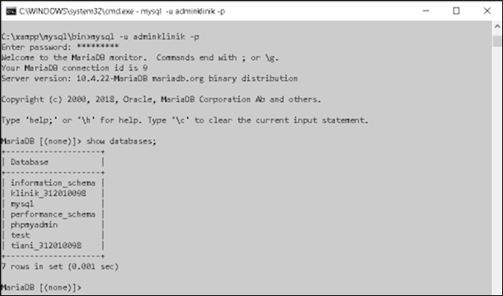
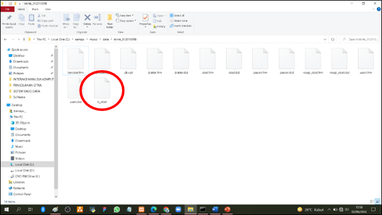

# TUGAS 6

KONEKSI BACKUP & RESTORE PADA MYSQL

Soal.
1.	Masuk ke databse adminklinik
2.	Lakukan proses backup dan recovery dengan sql dari database tugas seblumnya !
3.	Lakukan proses backup dan recovery dengan sqldump dari database tugas seblumnya !
4.	Tulisakan script cron job untuk melakukan backup otomatis setiap hari minggu jam 12 malam ! 
5.	Buat laporanya dan kirimkan di form tugas 6

Jawab : 

1). Database Klinik :

-	mysql -u adminklinik -p
-	********* (ketikan password)
-	show databases;

            
2). Proses Backup dan Recovery dengan SQL

2.1). Proses Backup SQL : 

-	use klinik_312010098;
-	show tables;

-	lock table obat write;

select * into outfile ‘b_obat’ from obat;

-	This PC – Local Disk (C:) – xampp – mysql – data – klinik_312010098

2.2). Proses Recovery SQL :

-	select * from obat;
-	delete from obat;

-	select * from obat; (after di delete data sudah kosong)

-	load data infile 'b_obat' into table obat;
-	select * from obat; (after di restore data sudah ada kembali)

3). Proses Backup dan Recovery dengan SQLDump

3.1). Proses Backup SQLDump :
-	mysqldump -u adminklinik -p klinik_312010098 > backup2.sql

3.2). Proses Recovery SQLDump :
-	mysqldump -u adminklinik -p klinik_312010098 < C:\xampp\mysql\bin\backup2.sql

-	Dump complate 

4). Scrip Cron Job Backup otomatis setiap hari minggu jam 12 malam :

"mysql -u adminklinik -p 312010098 klinik_312010098 > backup2.sql"
